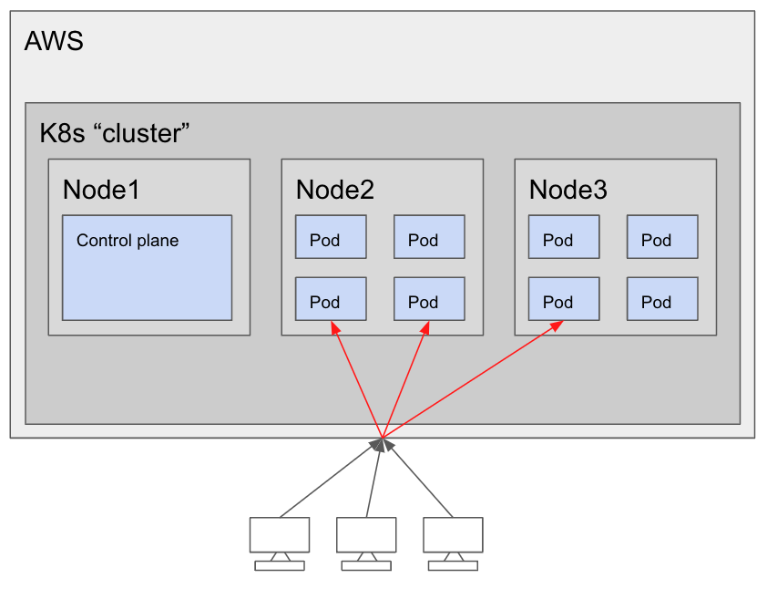

# How to roll your own k8s

I denne workshoppen skal vi se nærmere på hvordan en setter opp et eget Kubernetes-cluster fra scratch på egne VMer. Målet er å en dypere kjennskap til hva som faktisk skal til for å drifte sitt eget cluster uten å bruke plug-n-play løsningene en finner hos de store skyleverandørene.

Til dette kurset kreves det at en har:
- En AWS-konto
- Basic kjennskap til Terraform og kommandolinjen

Vi skal gå gjennom:
- Hvordan installere Kubernetes på et cluster av Ubuntu-maskiner
- Hvordan installere ett nettverkslag i Kubernetes, så maskinene våre kan snakke sammen og fordele lasten mellom seg
- Hvordan deploye en applikasjon gjennom `YAML`-konfigurasjonsfiler
- Hvordan deploye en applikasjon med `Helm`-charts
- Hvordan oppgradere Kubernetes-versjonen i clusteret

# Architectural Overview
- We will use self-hosted virtual machines (EC2 instances) in AWS as nodes in our cluster
- In total we will use three nodes, one for the Kubernetes control plane (more on this later) and two for our data plane, where our applications (pods) will be running.

Downdown

Tekst

