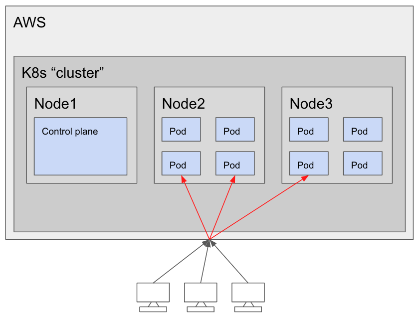

# How to roll your own k8s

In this workshop we will take a closer look on how to setup your own Kubernetes cluster from scratch, on your own virtual machines. The goal is to get a deeper understanding of what it actually takes to manage your own cluster without the plug-n-play solutions offered by cloud providers.

The workshop assumes that you have the following prerequisites:

- Basic knowledge of Terraform and the command line.
- An AWS account

We will be go through:

- How to install the Kubernetes runtime on a set of Ubuntu virtual machines
- How to install networking in Kubernetes, so that our applications can reach each other and communicate
- How to deploy an application with `YAML` configuration files
- How to deploy an application with `Helm` charts
- How to upgrade Kubernetes clusters to newer versions

# Prerequisites

## jq
For running the script for ssh-ing into machines, JQ is required. Install trough brew.

## aws-vault (Optional but highly recommended)
In order to easily manage what account you have activated in your cli environment, we highly recommend using aws-vault.
Having aws-vault installed, you can simply enter the access keys from the AWS IAM User and get temporary sessions in a subshell by simple commands.
Read more about aws vault here:
https://github.com/99designs/aws-vault

Pros: 
- does not store secrets in plane text
- access to correct env by simple profile commands
- supports aws cli out of the box
- has features for running ec2 security meta servers

Cons:
- Most people are probably used to the --profile. But just try it. You will love it!

### How to use it?
1. Activate a shell by `aws-vault exec <profile>`
1. Login in a browser with `aws-vault login <profile>`
1. Thank me later 

## Terraform

In order to do this workshop, you need to have `terraform` installed. We recommend installing it through [`tfenv`](https://github.com/tfutils/tfenv).

<details>
<summary>Installing on macOS</summary>

Detailed instruction can be found in the [official docs](https://github.com/tfutils/tfenv?tab=readme-ov-file#automatic).

Install `tfenv`, the Terraform Version Manager through homebrew:

```bash
brew install tfenv
```

If you do not have homebrew installed, follow the instructions here: [https://brew.sh/](https://brew.sh/)

Then `cd` into the `infra` folder in this repository and run `terraform init`, which will automatically install the correct Terraform version used in this workshop.

Verify your installation with the following command:

```
terraform --version
```

It should print your currently active version.

</details>

<details>
<summary>Installing on Linux/Windows (WSL) (Not tested)</summary>

Detailed instruction can be found in the [official docs](https://github.com/tfutils/tfenv?tab=readme-ov-file#manual).

Check out `tfenv` into any path (here is `${HOME}/.tfenv`)

```bash
git clone --depth=1 https://github.com/tfutils/tfenv.git ~/.tfenv
```

Add `~/.tfenv/bin` to your $PATH any way you like

bash:

```bash
echo 'export PATH="$HOME/.tfenv/bin:$PATH"' >> ~/.bash_profile
```

zsh:

```zsh
echo 'export PATH="$HOME/.tfenv/bin:$PATH"' >> ~/.zprofile
```

You might need to open a new shell in order to use the new `PATH`.

Then `cd` into the `infra` folder in this repository and run `terraform init`, which will automatically install the correct Terraform version used in this workshop.

Verify your installation with the following command:

```
terraform --version
```

It should print your currently active version.

</details>

## AWS Account

Our infrastructure will be hosted in AWS, and thus you require an AWS user.

When creating an account in AWS, you will by default create a single root user, that has admin permissions access to absolutely everything inside your account. This is a major security risk, and you should always create and use another account with less permissions.

# Setup IAM User 
1. Log in to your aws account with 
1. Go to IAM service
1. Create new IAM user
1. Setup MFA
1. Create Secruity credentials
1. Add profile to aws-vault

## Verify access
Run `aws sts get-caller-identity` in order to assure you have the correct env setup locally. 

# Architectural Overview

- We will use self-hosted virtual machines (EC2 instances) in AWS as nodes in our cluster
- In total we will use three nodes, one for the Kubernetes control plane (more on this later) and two for our data plane, where our applications (pods) will be running.



<details>
<summary>Vocabulary</summary>

[Control plane](https://kubernetes.io/docs/reference/glossary/?fundamental=true#term-control-plane)

- The container orchestration layer that exposes the API and interfaces to define, deploy, and manage the lifecycle of containers

[Data plane](https://kubernetes.io/docs/reference/glossary/?fundamental=true#term-data-plane)

- The container orchestration layer that exposes the API and interfaces to define, deploy, and manage the lifecycle of containers

</details>

## What are Control Plane components?

The Kubernetes "Control plane" entails the components and software you need in order to manage your Kubernetes cluster.
Like regular applications running in a Kubernetes cluster, these components are made up of Kubernetes resources like pods,
deployments and stateful sets. Other approaches run these services "natively" on the nodes in the cluster itself, usually as
`systemd` services or similar. There are multiple ways to deploy the control plane, where we will use `kubeadm` to set it up
for us. For more details on deployment options, check out the [official architecture variation documentation](https://kubernetes.io/docs/concepts/architecture/#architecture-variations).

The components that make up the control plane are the following services:

kube-apiserver

- The front-facing REST API service that you interact with through `kubectl`

[etcd](https://etcd.io/)

- Highly available key-value store. All configuration for your cluster is stored here.

[cloud-controller-manager](https://kubernetes.io/docs/concepts/architecture/cloud-controller/)

- Responsible for cloud-specific control login. This is a separate component that is used in managed Kubernetes solutions like [EKS](https://aws.amazon.com/eks/), [GKE](https://cloud.google.com/kubernetes-engine) and [AKS](https://azure.microsoft.com/en-us/products/kubernetes-service). Not relevant for us.

kube-scheduler

- Watches for newly created pods and schedules them to one or more nodes

kube-controller-manager

- Runs a control loop, checking that nodes, replicas, services, tokens and endpoints are working and are in the desired state

<details>
<summary>Vocabulary</summary>

Control-plane

- The container orchestration layer that exposes the API and interfaces to define, deploy, and manage the lifecycle of containers

Node

- (Virtual) machines that are part of our cluster. Runs containerized applications.
Controlled by the control plane
</details>

## What are Node components?

All nodes run a set of services which together constitutes the Kubernetes runtime environment

kubelet

- Monitors the health of containers running on the node, making sure the containers specified as part of a pod are running

kube-proxy

- Network proxy responsible for maintaining the network rules on nodes

container runtime

- The container runtime used by Kubernetes. E.g. Docker, Containerd or CRI-O
  - In our example, we will use Docker

## Installing Kubernetes

Guide: [Creating a single control-plane cluster with kubeadm](https://kubernetes.io/docs/setup/production-environment/tools/kubeadm/create-cluster-kubeadm/)

**TODO: Update this step-by-step guide to 2024-standard. ALSO: Specify an older Kubernetes version (not too old!) so that we can update our cluster later.**

TL;DR:

1. Install Docker on your host machine. Docker will be detected automatically by Kubernetes on initialization as our container runtime
    1. <details>
        <summary>Solution</summary>
        ```
       sudo apt install docker.io
       ```
        </details>
3. (Jakob jobber med denne. Mer spesifikt. Leser om flanell og pr;ver [ finne ut hvordan installere) Decide on a Pod network add-on. This is required to get network between your pods. We will use [Flannel](https://github.com/coreos/flannel).
4.                             Install kubeadm, kubelet and kubectl on the host machine (Guide)
    Add Google GPG key to keystore
    `sudo apt-get install -y kubelet kubeadm kubectl`
5.                             Initialize Kubernetes on your host with the following command:
    `kubeadm init --pod-network-cidr=10.244.0.0/16`
    Note: `--pod-network-cidr=10.244.0.0/16` is required to use Flannel as networking
6.                             Install Flannel:
    `kubectl apply -f https://raw.githubusercontent.com/coreos/flannel/2140ac876ef134e0ed5af15c65e414cf26827915/Documentation/kube-flannel.yml`

<details>
<summary>Vocabulary</summary>

Control-plane

- The container orchestration layer that exposes the API and interfaces to define, deploy, and manage the lifecycle of containers

Node

- (Virtual) machines that are part of our cluster. Runs containerized applications.
  Controlled by the control plane

Addon

- Extra features that uses Kubernetes resources (DaemonSet, Deployment, etc) as implementation. They are really just sets of Kubernetes objects.
- Common addons: CoreDNS, Dashboard, Networking (Flannel++), Logging, Monitoring

</details>

## What is a Pod network addon?

Kubernetes does not enable communication between pods by default.

The networking contract in Kubernetes says that all pods must have a unique IP address inside the cluster, in order to route between Kubernetes objects, avoiding port collisions.

Kubernetes comes with the CoreDNS addon by default, but it does not start before a [network is installed](https://kubernetes.io/docs/setup/production-environment/tools/kubeadm/create-cluster-kubeadm/#pod-network). Pods are given an IP address on creation, but DNS lookups between pods are not available before we have a network.

Multiple pod networks are available: [Calico](https://docs.projectcalico.org/introduction/), [Weave Net](https://www.weave.works/oss/net/), [kube-router](https://github.com/cloudnativelabs/kube-router), [Flannel](https://github.com/coreos/flannel)++

## Flannel - the network fabric

We chose to use Flannel for our cluster networking. Why? Because a friend on Discord used it on his Raspberry Pi Kubernetes cluster

Each network addon uses their own default IP range.

- Flannel uses `10.244.0.0/16` by default, hence the `--pod-network-cidr=10.244.0.0/16` argument to kubeadm when creating the cluster.
  - `10.244.0.0/16` is known as CIDR notation, hence the argument name

Once Flannel is installed, CoreDNS should be running

- Can be checked with: `kutectl get pods --all-namespaces`

## Where are we now?

We have a cluster!

We have networking between pods!

But we don’t have any applications :(

## Deploying our first application

**TODO: Here we can be a bit more creative. How about a a backend and a NextJS-app that performs server-side rendering? Then we can check that out networking is functional**

We want to deploy a container that responds with “Hello world!” when receiving a request

- This little beauty: https://github.com/paulbouwer/hello-kubernetes

## Containers, pods, replicas, deployments, services

A unit we want to deploy is called a pod.

A pod can consist of multiple containers that makes up the application. We only have one container per pod in our example.

We want multiple copies of our pod to run simultaneously, these are called replicas.

Together, this configuration constitutes a deployment.

Each pod is an independent Kubernetes object. We can hide this detail behind a service, that can load balance (and more) between the pods

## Deploying with YAML configuration

Kubernetes configuration files are written in YAML.

Configuration for our hello-kubernetes deployment →

Deploy with the following command:

- `kubectl apply -f hello-kubernetes-deployment.yml`

```
apiVersion: apps/v1
kind: Deployment
metadata:
  name: hello-kubernetes
spec:
  replicas: 3
  selector:
    matchLabels:
      app: hello-kubernetes
  template:
    metadata:
      labels:
        app: hello-kubernetes
    spec:
      containers:
      - name: hello-kubernetes
        image: paulbouwer/hello-kubernetes:1.8
        ports:
        - containerPort: 8080
```

Create a service to abstract away the pods →
Deploy with the following command:

- `kubectl apply -f hello-kubernetes-service.yml`

```
apiVersion: v1
kind: Service
metadata:
  name: hello-kubernetes
spec:
  type: LoadBalancer
  ports:
  - port: 80
    targetPort: 8080
  selector:
    app: hello-kubernetes
```

## Where are we now?

We have a cluster!

We have networking between pods!

We have a deployment!

But we don’t have any users :(

## We need to expose our service to the world!

We need an Ingress to route traffic into our cluster

Install an ingress-controller. We will use [nginx-ingress](https://docs.nginx.com/nginx-ingress-controller/installation/installation-with-manifests/).

Make sure to deploy with a DaemonSet configuration, it makes life easier

Deploy an ingress that routes traffic to our service:

- `kubectl apply -f hello-kubernetes-ingress.yml`

```
apiVersion: networking.k8s.io/v1beta1
kind: Ingress
Metadata:
  name: hello-kubernetes-ingress
spec:
  Rules:
    - host: kubernetes.santi.no
      http:
        paths:
        - path: /
          backend:
            serviceName: hello-kubernetes
            servicePort: 80
```

## Where are we now?

We have a cluster!

We have networking between pods!

We have a deployment!

We have users!

## Next steps

- Setup SSL/TLS termination in our Ingress
- Add another node to the cluster
- [Upgrade your Kubernetes cluster version without downtime](https://github.com/stakater/til/blob/master/kubernetes/upgrading-clusters-with-zero-downtime.md)
- Setup logging and monitoring (Prometheus and Grafana). Use Helm charts for this.
