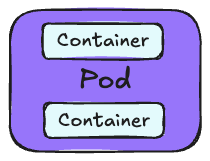
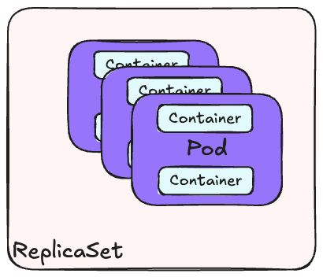
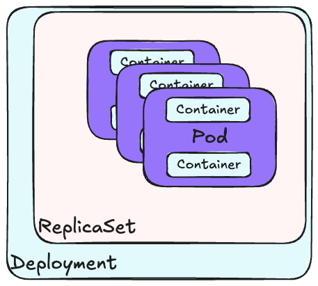

# How to roll your own k8s

In this workshop we will take a closer look on how to setup your own Kubernetes cluster from scratch, on your own virtual machines. The goal is to get a deeper understanding of what it actually takes to manage your own cluster without the plug-n-play solutions offered by cloud providers.

The workshop assumes that you have the following prerequisites:

- Basic knowledge of Terraform and the command line.
- An AWS account

We will be go through:

- How to install the Kubernetes runtime on a set of Ubuntu virtual machines
- How to install networking in Kubernetes, so that our applications can reach each other and communicate
- How to deploy an application with `YAML` configuration files
- How to deploy an application with `Helm` charts
- How to upgrade Kubernetes clusters to newer versions

# Prerequisites

## jq

For running the script for ssh-ing into machines, JQ is required. Install through brew.

<details>
<summary>Installing on macOS</summary>

If you do not have homebrew installed, follow the instructions here: [https://brew.sh/](https://brew.sh/)

```
brew install jq
```

</details>

<details>
<summary>Installing on Linux/Windows (WSL) (Not tested)</summary>

```
sudo apt-get update
sudo apt-get install jq
```

</details>

## AWS CLI

To manage your AWS account, you need the [AWS CLI](https://docs.aws.amazon.com/cli/latest/userguide/getting-started-install.html)

<details>
<summary>Installing on macOS</summary>

If you do not have homebrew installed, follow the instructions here: [https://brew.sh/](https://brew.sh/)

```
brew install awscli
```

</details>

<details>
<summary>Installing on Linux/Windows (WSL) (Not tested)</summary>

```
sudo snap install aws-cli --classic
```

</details>

## AWS Account

Our infrastructure will be hosted in AWS, and thus you require an AWS user.

If you don't have an AWS Account, [sign up here](https://signin.aws.amazon.com/signup?request_type=register).

When creating an account in AWS, you will by default create a single root user, that has admin access to absolutely everything inside your account. This is a major security risk, and you should always create and use an IAM User with less permissions.

### Setup IAM User

1. Log in to your AWS account
1. Go to the IAM Service
1. Select "Access ,anagement -> Users" from the left-hand menu.
1. Press the orange "Create User" button
1. Provide a username and password. Make sure to tick the box "Provide user access to the AWS Management Console"
1. On the "Set Permissions" page, click the "Attach policies directly" box and attach "AdministratorAccess". Note: This is sually a pretty bad idea, and you should probably delete this user once your are done with the workshop.
1. Once your user has been created, log out and log back in again with your new user
1. You now need an Access Key. Click your username in the upper right corner and select "Security credentials"
1. Scroll down to the "Access keys" section and click "Create access key"
1. Select use case "Command Line Interface (CLI)". Tick the box where it says you understand what you are doing and click "Next"
1. Copy the Access Key and Secret Access Key to somewhere secure. You will not be able to view the secret again.

1. (Optional) Add profile to aws-vault, see below

## Verify access

Run `aws sts get-caller-identity` in order to assure you have the correct env setup locally.

## aws-vault (Optional but highly recommended)

In order to easily manage what account you have activated in your cli environment, we highly recommend using aws-vault.
Having aws-vault installed, you can simply enter the access keys from the AWS IAM User and get temporary sessions in a subshell by simple commands.
Read more about aws vault here and how to install it here:
https://github.com/99designs/aws-vault

Pros:

- does not store secrets in plaintext
- gives access to correct environment by simple profile commands
- supports aws-cli out of the box
- has features for running ec2 security meta servers

Cons:

- Most people are probably used to the --profile. But just try it. You will love it!

### How to use it?

1. Activate a shell by `aws-vault exec <profile>`
1. Login in a browser with `aws-vault login <profile>`
1. Thank me later

## Terraform

In order to do this workshop, you need to have `terraform` installed. We recommend installing it through [`tfenv`](https://github.com/tfutils/tfenv).

<details>
<summary>Installing on macOS</summary>

Detailed instruction can be found in the [official docs](https://github.com/tfutils/tfenv?tab=readme-ov-file#automatic).

Install `tfenv`, the Terraform Version Manager through homebrew:

```bash
brew install tfenv
```

If you do not have homebrew installed, follow the instructions here: [https://brew.sh/](https://brew.sh/)

Then `cd` into the `infra` folder in this repository and run `terraform init`, which will automatically install the correct Terraform version used in this workshop.

Verify your installation with the following command:

```
terraform --version
```

It should print your currently active version.

</details>

<details>
<summary>Installing on Linux/Windows (WSL) (Not tested)</summary>

Detailed instruction can be found in the [official docs](https://github.com/tfutils/tfenv?tab=readme-ov-file#manual).

Check out `tfenv` into any path (here is `${HOME}/.tfenv`)

```bash
git clone --depth=1 https://github.com/tfutils/tfenv.git ~/.tfenv
```

Add `~/.tfenv/bin` to your $PATH any way you like

bash:

```bash
echo 'export PATH="$HOME/.tfenv/bin:$PATH"' >> ~/.bash_profile
```

zsh:

```zsh
echo 'export PATH="$HOME/.tfenv/bin:$PATH"' >> ~/.zprofile
```

You might need to open a new shell in order to use the new `PATH`.

Then `cd` into the `infra` folder in this repository and run `terraform init`, which will automatically install the correct Terraform version used in this workshop.

Verify your installation with the following command:

```
terraform --version
```

It should print your currently active version.

</details>

# Architectural Overview

- We will use self-hosted virtual machines (EC2 instances) in AWS as nodes in our cluster
- In total we will use three nodes, one for the Kubernetes control plane (more on this later) and two for our worker nodes, where our applications (pods) will be running.

<details>
<summary>Vocabulary</summary>

[Node](https://kubernetes.io/docs/concepts/architecture/nodes/)

- (Virtual) machines that are part of our Kubernetes cluster. In this workshop we will use 3 nodes that are EC2 instances hosted in AWS.

[Control plane](https://kubernetes.io/docs/reference/glossary/?fundamental=true#term-control-plane)

- The container orchestration layer that exposes the API and interfaces to define, deploy, and manage the lifecycle of containers.
  The control plane usually runs on separate nodes from the worker nodes.
  In larger clusters, the control plane is usually distributed across multiple nodes for fault tolerance.

[Worker Nodes](https://kubernetes.io/docs/reference/glossary/?fundamental=true#term-data-plane)

- The nodes that run your applications (pods) and provide the networking and storage resources needed by those applications.
  There are usually multiple worker nodes in a cluster.

</details>


## What are Control Plane components?

The Kubernetes `Control plane` encompasses the components and software you need in order to manage your Kubernetes cluster.
Like regular applications/deployments running in a cluster, these components are made up of Kubernetes resources like pods,
deployments and stateful sets. There are other ways to run these services "natively" on a node in the cluster, usually as
`systemd` services or similar, but that will not be covered in this workshop.

There are multiple ways to deploy the control plane, where we will use `kubeadm` to set it up
for us. For more details on deployment options, check out the [official architecture variation documentation](https://kubernetes.io/docs/concepts/architecture/#architecture-variations).

The components that make up the control plane are the following services:

[kube-controller-manager](https://kubernetes.io/docs/concepts/architecture/#kube-controller-manager) `c-m`

- Runs a control loop, checking that nodes, replicas, services, tokens, endpoints++ are working and are in the desired state

[cloud-controller-manager](https://kubernetes.io/docs/concepts/architecture/cloud-controller/) `c-cm`

- Responsible for cloud-specific control login. This is a separate component that is used in managed Kubernetes solutions like [EKS](https://aws.amazon.com/eks/), [GKE](https://cloud.google.com/kubernetes-engine) and [AKS](https://azure.microsoft.com/en-us/products/kubernetes-service). Not relevant for us.

[kube-apiserver](https://kubernetes.io/docs/concepts/architecture/#kube-apiserver) `api`

- The front-facing REST API service that you interact with through `kubectl`

[etcd](https://etcd.io/) `etcd`

- Highly available key-value store. All configuration for your cluster is stored here.

[kube-scheduler](https://kubernetes.io/docs/concepts/architecture/#kube-scheduler) `sched`

- Watches for newly created pods and schedules them to one or more nodes that are part of the worker nodes


## What are Worker Node components?

In order for the Control Plane to be able to manage and schedule workloads, it needs to manage worker nodes to execute that workload.
In this workshop we will refer to these nodes as Worker Nodes or simply Workers.
The term Node is also used in Kubernetes documentation and literature, but for clarity in this course we will use the term Worker.

All worker nodes run a set of services which together constitutes the Kubernetes runtime environment. These components are:

[kubelet](https://kubernetes.io/docs/concepts/architecture/#kubelet) `kubelet`

- Responsible for running and monitoring the health of containers on the node, making sure the containers specified as part of a Pod (more on this later) are working as expected.

[kube-proxy (optional)](https://kubernetes.io/docs/concepts/architecture/#kube-proxy) `k-proxy`

- Network proxy responsible for maintaining the network rules on nodes.

[container runtime](https://kubernetes.io/docs/concepts/architecture/#container-runtime)

- The container runtime used by `kubelet` to run containers. There are multiple choices available here, including [containerd](https://containerd.io/docs/), [CRI-O](https://cri-o.io/#what-is-cri-o) and [Docker Engine](https://docs.docker.com/). In thruth, any implementation that adheres to the Kubernetes [Container Runtime Interface (CRI)](https://github.com/kubernetes/community/blob/master/contributors/devel/sig-node/container-runtime-interface.md) can be used. In this workshop, we will use Docker to run the ontainers on our nodes.


## Installing Kubernetes

Guide: [Creating a single control-plane cluster with kubeadm](https://kubernetes.io/docs/setup/production-environment/tools/kubeadm/create-cluster-kubeadm/)

**TODO: Update this step-by-step guide to 2024-standard. ALSO: Specify an older Kubernetes version (not too old!) so that we can update our cluster later.**


1. Prepare networking for k8s:
```bash
sudo apt-get update -y

sudo cat <<EOF | sudo tee /etc/modules-load.d/k8s.conf
overlay
br_netfilter
EOF

sudo sysctl --system
sudo sysctl -w net.ipv4.ip_forward=1

sudo modprobe overlay
sudo modprobe br_netfilter

swapoff -a
(crontab -l 2>/dev/null; echo "@reboot /sbin/swapoff -a") | crontab - || true

```

1. Install `containerd`, our container runtime
```bash
wget https://github.com/containerd/containerd/releases/download/v1.6.8/containerd-1.6.8-linux-amd64.tar.gz
sudo tar Cxzvf /usr/local containerd-1.6.8-linux-amd64.tar.gz

wget https://github.com/opencontainers/runc/releases/download/v1.1.3/runc.amd64
sudo install -m 755 runc.amd64 /usr/local/sbin/runc

wget https://github.com/containernetworking/plugins/releases/download/v1.1.1/cni-plugins-linux-amd64-v1.1.1.tgz
sudo mkdir -p /opt/cni/bin
sudo tar Cxzvf /opt/cni/bin cni-plugins-linux-amd64-v1.1.1.tgz

sudo mkdir /etc/containerd
containerd config default | sudo tee /etc/containerd/config.toml

sudo sed -i 's/SystemdCgroup \= false/SystemdCgroup \= true/g' /etc/containerd/config.toml
sudo curl -L https://raw.githubusercontent.com/containerd/containerd/main/containerd.service -o /etc/systemd/system/containerd.service

sudo systemctl daemon-reload
sudo systemctl enable --now containerd
sudo systemctl status containerd
```

1. Install Kubernetes tooling
```bash
mkdir -p /etc/apt/keyrings
curl -fsSL https://pkgs.k8s.io/core:/stable:/v1.31/deb/Release.key | sudo gpg --dearmor -o /etc/apt/keyrings/kubernetes-apt-keyring.gpg
echo "deb [signed-by=/etc/apt/keyrings/kubernetes-apt-keyring.gpg] https://pkgs.k8s.io/core:/stable:/v1.31/deb/ /" | sudo tee /etc/apt/sources.list.d/kubernetes.list

sudo apt-get update -y
sudo apt-get install -y kubelet kubeadm kubectl
sudo apt-mark hold kubelet kubeadm kubectl

sudo apt install jq -y
export local_ip="$(ip --json addr show ens5 | jq -r '.[0].addr_info[] | select(.family == "inet") | .local')"
export IPADDR="$local_ip"
echo "KUBELET_EXTRA_ARGS=--node-ip=$local_ip" | sudo tee /etc/default/kubelet > /dev/null
```

1. Export required cluster config variables
```bash
export NODENAME=$(hostname -s)
export POD_CIDR="10.244.0.0/16"

```

1. Create K8s cluster
```bash
sudo kubeadm init --apiserver-advertise-address=$IPADDR  --apiserver-cert-extra-sans=$IPADDR  --pod-network-cidr=$POD_CIDR --node-name $NODENAME --ignore-preflight-errors Swap
```

1. Make k8s available to current user 
```bash
mkdir -p $HOME/.kube
sudo cp -i /etc/kubernetes/admin.conf $HOME/.kube/config
sudo chown $(id -u):$(id -g) $HOME/.kube/config
```
1. Copy the kubeadm join command from output. 
```bash
sudo kubeadm join [YOURMASTERNODEIP]:6443 - token [thetokendisplayed] \
 - discovery-token-ca-cert-hash sha256:[thetokendisplayed]
```

1. Verify the Nodes are registered:

```bash
kubectl get nodes
```
Note: All notes should have status NotReady as they are missing internet
You can also see the pods running:
```bash
kubectl get pods  --all-namespaces
```

<details>
<summary>Vocabulary</summary>

Control-plane

- The container orchestration layer that exposes the API and interfaces to define, deploy, and manage the lifecycle of containers

Node

- (Virtual) machines that are part of our cluster. Runs containerized applications.
  Controlled by the control plane

Addon

- Extra features that uses Kubernetes resources (DaemonSet, Deployment, etc) as implementation. They are really just sets of Kubernetes objects.
- Common addons: CoreDNS, Dashboard, Networking (Flannel++), Logging, Monitoring

</details>

## Install Flannel 
`kubectl apply -f https://github.com/flannel-io/flannel/releases/latest/download/kube-flannel.yml`

## What is a Pod network addon?

Kubernetes does not enable communication between pods by default.

The networking contract in Kubernetes says that all pods must have a unique IP address inside the cluster, in order to route between Kubernetes objects, avoiding port collisions.

Kubernetes comes with the CoreDNS addon by default, but it does not start before a [network is installed](https://kubernetes.io/docs/setup/production-environment/tools/kubeadm/create-cluster-kubeadm/#pod-network). Pods are given an IP address on creation, but DNS lookups between pods are not available before we have a network.

Multiple pod networks are available: [Calico](https://docs.projectcalico.org/introduction/), [Weave Net](https://www.weave.works/oss/net/), [kube-router](https://github.com/cloudnativelabs/kube-router), [Flannel](https://github.com/coreos/flannel)++

## Flannel - the network fabric

We chose to use Flannel for our cluster networking. Why? Because a friend on Discord used it on his Raspberry Pi Kubernetes cluster

Each network addon uses their own default IP range.

- Flannel uses `10.244.0.0/16` by default, hence the `--pod-network-cidr=10.244.0.0/16` argument to kubeadm when creating the cluster.
  - `10.244.0.0/16` is known as CIDR notation, hence the argument name

Once Flannel is installed, CoreDNS should be running

- Can be checked with: `kutectl get pods --all-namespaces`

## Where are we now?

We have a cluster!

We have networking between pods!

But we don’t have any applications `:(`


## Containers, pods, replicas, deployments, services

[Pods](https://kubernetes.io/docs/concepts/workloads/pods/) are the smallest deployable units of computing that you can create and manage in Kubernetes. A Pod's contents are always co-located and co-scheduled, and run in a shared context. A Pod models an application-specific "logical host": it contains one or more application containers which are relatively tightly coupled.


A Pod is a group of one or more containers, with shared storage and network resources, and a specification for how to run the containers. We only have one container per pod in our example, which is a fairly common use-case. As well as application containers, a Pod can contain init containers that run during Pod startup. You can also inject ephemeral containers for debugging a running Pod.



We want multiple copies of our pod to run simultaneously, these are called replicas. Replicas are controlled by [ReplicaSets](https://kubernetes.io/docs/concepts/workloads/controllers/replicaset/). A ReplicaSet ensures that a specified number of pod replicas are running at any given time. If there are too many pods running, it will terminate some of them; if there are too few, it will create new ones. This is useful for scaling and ensuring high availability.



Together, this configuration constitutes a [Deployment](https://kubernetes.io/docs/concepts/workloads/controllers/deployment/). A Deployment manages ReplicaSets and provides declarative updates to Pods along with a lot of other useful features (like rolling updates, rollbacks, etc.). A Deployment also functions as a gathering backend for other objects like Ingress and Services. It is one of the most commonly used Kubernetes object types.



Each pod is an independent Kubernetes object, and the ReplicaSets and Deployments manage the scaling and lifecycle of the pods. The network traffic however is not managed by deployments, but rather by a [Service](https://kubernetes.io/docs/concepts/services-networking/service/). A Service is an abstraction that defines a logical set of Pods and a policy by which to access them. A Service provides a stable network identity to Pods, even if the pods are recreated or scaled. Services can be exposed internally within the cluster or externally to the internet. They also provide load balancing and service discovery capabilities.


In our workshop, we use a [NodePort](https://kubernetes.io/docs/concepts/services-networking/service/#type-nodeport) Service, which is a very simple service type that exposes a service on each Node's IP at a static port. This is useful for development and testing, but not recommended for production. This means that you can access the service by using any of the nodes' IPs and the static port. The default range for NodePorts is 30000-32767, but this can be configured in the Kubernetes cluster configuration.


The other common Service type is a [LoadBalancer](https://kubernetes.io/docs/concepts/services-networking/service/#loadbalancer), which is used to expose a service externally through an Ingress. This type of service is typically used in production environments.


## Deploying our first application

We want to deploy a container that responds with “Hello world!” when receiving a request


### Deploying with YAML configuration

Kubernetes configuration files are written in YAML.

Configuration for our `hello-kubernetes` deployment can be found below. Put it inside a `hello-world-deployment.yaml` file and apply it with `kubectl apply -f hello-world-deployment.yaml`:

```yaml
apiVersion: apps/v1
kind: Deployment
metadata:
  name: hello-kubernetes
  labels:
    app: hello-kubernetes
spec:
  replicas: 3
  selector:
    matchLabels:
      app: hello-kubernetes
  template:
    metadata:
      labels:
        app: hello-kubernetes
    spec:
      containers:
        - name: hello-kubernetes
          image: paulbouwer/hello-kubernetes:1.8
          ports:
            - containerPort: 8080
```
This will create a Deployment with a ReplicaSet of three pods. Each pod will run a container with the `paulbouwer/hello-kubernetes:1.8` image. The container listens on port `8080`. The Deployment ensures that there are always three pods running. If a pod goes down, the Deployment will automatically create a new one to replace it.

We now want a service to abstract away the pods. We will be using a NodePort Service that will expose the Pods to the outside world. Put the following configuration in a file called `hello-world-service.yaml` and apply it with the following command: `kubectl apply -f hello-world-service.yaml`

```yaml
apiVersion: v1
kind: Service
metadata:
  name: hello-kubernetes-service
spec:
  type: NodePort
  ports:
    - port: 80
      targetPort: 8080
  selector:
    app: hello-kubernetes
```

### Where are we now?

We have a cluster!

We have networking between pods!

We have a deployment!

And we have a hacky way to access a service inside out Cluster! Now you can check out your ip/public dns and connect to the nodeport.
You can find you public ips from aws by running `aws ec2 describe-instances --query "Reservations[*].Instances[*].{ip:PublicIpAddress,privip:PrivateIpAddress,tags:Tags}"`
To ge the port the service is forwarding packtes to, run: 
```bash
kubectl get service hello-kubernetes-service -o jsonpath='{.spec.ports[0].nodePort}'
```

put these together as in:
etc: `ec2.dns.compute.aws:32001`
and you should have you perfectly styled website!

## Deploying a Helm Chart

- Install Helm
- Deploy a Chart and expose it through a NodePort

## Next steps
- Kill a node and watch how your deployments react. They will be moved to another node in just a few seconds.
- Fix nginx-ingress in order to have load balancers and ingress routes without going directly at a service
- Setup SSL/TLS termination in our Ingress
- Add another node to the cluster
- [Upgrade your Kubernetes cluster version without downtime](https://github.com/stakater/til/blob/master/kubernetes/upgrading-clusters-with-zero-downtime.md)
- Setup logging and monitoring (Prometheus and Grafana). Use Helm charts for this.
